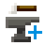

# TFG Anvil Calculator Plus

Welcome to the TFG Anvil Calculator Plus! This tool helps you determine the most efficient sequence of smithing actions to always get a perfectly forged item in the TerraFirmaGreg modpack.

Link to the tool: https://ignis621.github.io/tfg-anvil-calculator-plus/src/index.html

This is a fork of [tfg-anvil-calculator](https://github.com/AdrianMiller99/tfg-anvil-calculator) by AdrianMiller99. Changes are outlined in [Changes in this fork](#changes-in-this-fork).

## How to Use

### 1. Choose Smithing Instructions
Select up to three smithing instructions from the provided options:
- **Punch**
- **Bend**
- **Upset**
- **Shrink**
- **Hit**
- **Draw**
- **None** (if fewer than three instructions are needed)

For each instruction, assign a priority (Last, Second Last, Third Last, Not Last, Any).

**Make sure that the instructions and their priorities are matching those of the in-game anvil GUI.**

### 2. Set Your Target Value
Unless I'm mistaken, you can't actually see the target value in-game, unless you use a resource pack like
[this](https://www.curseforge.com/minecraft/texture-packs/tfc-tng-anvilgui-easy-smithing).
Once you have the resource pack installed, you can see the target value in the anvil GUI.
With this target value, you can now use the calculator.
Enter the target value you see in the in-game anvil GUI in the input field labeled "Target Value" on the calculator.

### 3. Calculate
Click the "Calculate" button to generate the most efficient setup and final instructions. The results will be displayed below, 
showing the necessary smithing actions as images.

The resulting actions that you need to perform in-game are divided into two sections:
- **Setup**: The initial setup actions that you need to perform to reach the _pre-target value_. 
This is the value you need to reach before you can start performing the final actions which are dictated to you by the instructions.
The order of these actions is irrelevant.
- **Finally**: The final actions that you need to perform to reach the target value. After performing these actions in 
the order shown on the calculator (left to right, top to bottom), you should have a perfectly forged item.

### 4. Switch Between Light and Dark Modes
Use the toggle switch in the top right corner to switch between light and dark modes according to your preference.

## Changes in this Fork

This fork introduces improvements and changes:

* Replaced the original heuristic-based best hit selector with a Breadth-First Search (BFS) pathfinder. This ensures that the calculator always finds the most optimal solution.
* Added the anvil's `0–150` slider clamping for edge cases
* Improved rule validation
* The calculator computes and displays the results in real-time as you type the target value, adjust instruction dropdowns, pick actions, or clear rows
* Result icons now fade in when calculated to indicate changes
* Setup and final action icons display tooltips showing their name and numerical impact (`Punch (+2)`, `Light Hit (-3)` etc) on hover
* Added a clear button next to each instruction set row to easily reset individual rules

## Support
If you encounter any issues or have suggestions for improvements, feel free to [open an issue](https://github.com/ignis621/tfg-anvil-calculator-plus/issues/new/choose) on this repository.

# License
This project is licensed under the European Union Public Licence (EUPL) 1.2. See the LICENSE file for details.
